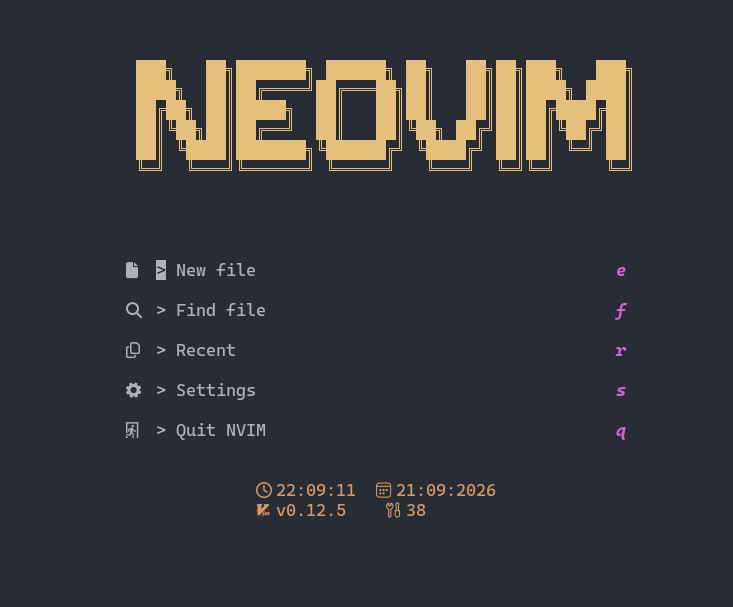
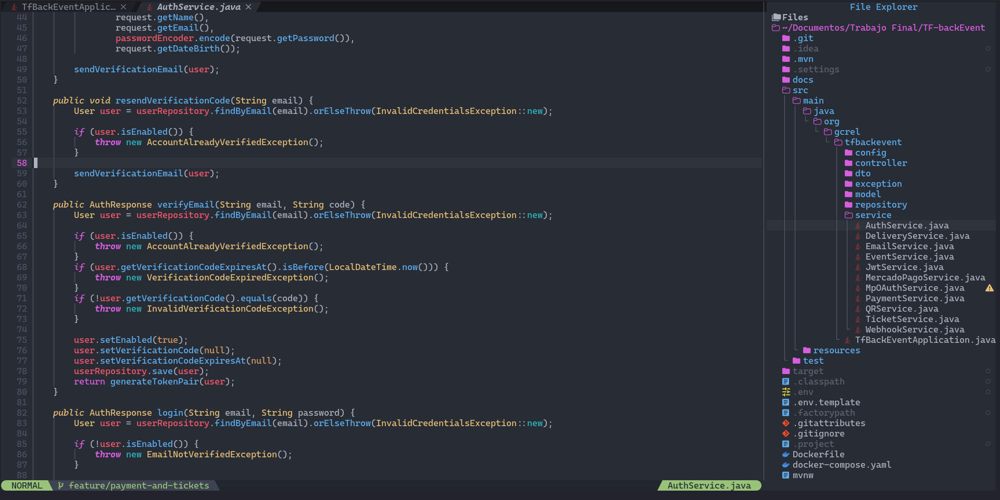

# Neovim Configuration (v0.11+)

Configuración personal de Neovim v0.11.5, construida desde cero e integrada con:

* **lazy.nvim** (gestor de plugins)
* **LSP** (nvim-lspconfig + Mason)
* **blink.cmp** (autocompletado)
* **Treesitter** (resaltado sintáctico)
* **OneDarkPro** (tema) con UI moderna
* **noice.nvim** (mensajes y notificaciones mejorados)
* **alpha-nvim** (dashboard de inicio)
* **Copilot** (sugerencias con IA)
* **nvim-dap** (debugging)
* **Conform** (formateo automático)
* **gitsigns / diffview** (integración con Git)
* Atajos personalizados optimizados

---

## Capturas





## Requisitos previos

### Nerd Font

Descargar desde [https://www.nerdfonts.com/](https://www.nerdfonts.com/)

### Dependencias recomendadas

| Herramienta | Uso |
|-------------|-----|
| ripgrep | Búsquedas rápidas (Telescope) |
| fd | Búsqueda de archivos |
| Node.js | Algunos LSPs |
| Go | LSP gopls (opcional) |

### Dependencias de image.nvim (renderizado de imágenes)

Este plugin requiere dependencias a nivel de sistema para crear el entorno de `hererocks`, compilar la librería `magick` y renderizar los gráficos.

**Fedora:**

```bash
sudo dnf install gcc make unzip curl python3 ImageMagick ImageMagick-devel lua luarocks
```

> `ImageMagick-devel` es crítico. Si falla la instalación del plugin en Neovim, elimina la caché de rocas (`rm -rf ~/.local/share/nvim/lazy-rocks`) y reinicia el editor.

**Windows:** la instalación nativa falla por incompatibilidades con LuaJIT FFI y por la falta de soporte de protocolos gráficos en consolas nativas.

* Entorno recomendado: **WSL2** (instalando las dependencias de Linux listadas arriba).
* Terminal recomendada: **WezTerm** desde Windows, ya que soporta el protocolo gráfico necesario para renderizar las imágenes emitidas desde WSL2.

---

## Instalación

### Windows

```powershell
git clone https://github.com/GCrel/nvim $env:LocalAppData/nvim
nvim
```

Luego ejecutar: `:Lazy sync`

### Linux / macOS

```bash
git clone https://github.com/GCrel/nvim ~/.config/nvim
nvim
```

Luego ejecutar: `:Lazy sync`

---

## Estructura del proyecto

```
nvim/
├── init.lua
├── lazy-lock.json
├── lua
│   ├── config
│   │   ├── keymaps.lua
│   │   ├── lazy.lua
│   │   └── options.lua
│   ├── util
│   │   └── lsp.lua
│   └── plugins
│       ├── coding
│       │   ├── autopairs.lua
│       │   ├── comment.lua
│       │   ├── conform.lua
│       │   └── copilot.lua
│       ├── dap
│       │   └── dap.lua
│       ├── editor
│       │   ├── neo-tree.lua
│       │   ├── telescope.lua
│       │   ├── toggleterm.lua
│       │   └── treesitter.lua
│       ├── git
│       │   ├── diffview.lua
│       │   └── gitsigns.lua
│       ├── lsp
│       │   ├── blink-cmp.lua
│       │   ├── jdtls.lua
│       │   ├── lazydev.lua
│       │   └── servers.lua
│       ├── markdown
│       │   ├── image.lua
│       │   └── markdown.lua
│       └── ui
│           ├── alpha.lua
│           ├── bufferline.lua
│           ├── indent-blankline.lua
│           ├── lualine.lua
│           ├── noice.lua
│           └── theme.lua
└── README.md
```

## Plugins incluidos

| Plugin | Función |
|--------|---------|
| lazy.nvim | Gestor de plugins |
| alpha-nvim | Dashboard de inicio |
| nvim-autopairs | Autocierre de pares |
| bufferline.nvim | Línea de buffers |
| onedarkpro.nvim (onedark_vivid) | Tema |
| Comment.nvim | Comentarios |
| blink.cmp | Autocompletado (LSP, buffer, snippets, path) |
| conform.nvim + mason-conform | Formateo al guardar (google-java-format, prettier) |
| copilot.lua | Sugerencias con IA |
| nvim-dap + dap-ui | Debugging |
| diffview.nvim | Vista de diffs de Git |
| gitsigns.nvim | Marcadores de Git en la línea |
| indent-blankline | Guías de indentación |
| noice.nvim | UI de mensajes, notificaciones y LSP |
| lazydev.nvim | Soporte de librerías para Lua |
| nvim-jdtls | LSP de Java |
| lualine.nvim | Barra de estado |
| render-markdown.nvim | Renderizado de Markdown |
| image.nvim | Renderizado de imágenes (markdown, neorg, etc.) |
| neo-tree + nvim-lsp-file-operations | Explorador de archivos (rename/move vía LSP) |
| telescope.nvim | Búsqueda fuzzy |
| toggleterm.nvim | Terminal integrado |
| nvim-treesitter | Resaltado e indentación |

---

## LSP incluido

| LSP | Lenguaje |
|-----|----------|
| lua_ls | Lua |
| jdtls | Java |
| ltex_plus | Español (ortografía/gramática, es-AR) en markdown/text/gitcommit |
| ts_ls | TypeScript / JavaScript |
| angularls | Angular |
| html | HTML |
| cssls | CSS |
| emmet_ls | Emmet (HTML/CSS) |
| eslint | ESLint (JS/TS) |

Para instalar más: `:Mason`

El LSP de Angular (`angularls`) se configura automáticamente buscando los `ngserver` en el `node_modules` del proyecto y tomando `angular.json` como raíz.

El LSP de Java (jdtls) se configura automáticamente con:
* Soporte para Maven, Gradle y `.git` como directorios raíz del proyecto
* Lombok integrado (javaagent)
* Debugging remoto (java-debug-adapter) y tests (java-test) vía Mason
* Organización de imports, extracción de variables/constantes y ejecución de tests

---

## Keybindings completos

### Buffer Control

| Atajo | Acción |
|-------|--------|
| `<Tab>` | Siguiente buffer |
| `<S-Tab>` | Buffer anterior |
| `<leader>bc` | Cerrar buffer actual |
| `<leader>bs` | Guardar y cerrar buffer |

### Portapapeles

| Atajo | Acción |
|-------|--------|
| `cp` | Copiar (normal/visual) |
| `cv` | Pegar (normal/visual) |
| `x` | Borrar sin copiar |
| `<leader>a` | Seleccionar todo |

### Operaciones de línea

| Atajo | Acción |
|-------|--------|
| `<leader>d` | Duplicar línea |
| `<C-j>` | Mover línea/selección abajo |
| `<C-k>` | Mover línea/selección arriba |

### Selección

| Atajo | Acción |
|-------|--------|
| `<leader>s` | Seleccionar hasta fin de línea |
| `<leader>sl` | Seleccionar línea completa |

### Búsqueda y Navegación

| Atajo | Acción |
|-------|--------|
| `<leader>f` | Buscar en archivos (live_grep) |
| `<leader>p` | Buscar archivos (find_files) |
| `<leader>o` | Archivos recientes (oldfiles) |
| `<C-n>` | Toggle Neo-tree |
| `<leader>e` | Focus Neo-tree |

### Comentarios

| Atajo | Acción |
|-------|--------|
| `<C-/>` | Comentar línea (normal) |
| `<C-/>` | Comentar selección (visual) |

### Terminal

| Atajo | Acción |
|-------|--------|
| `<leader>th` | Terminal horizontal |
| `<leader>tf` | Terminal flotante |

### LSP - Navegación

| Atajo | Acción |
|-------|--------|
| `gd` | Ir a definición |
| `gD` | Ir a declaración |
| `gi` | Ir a implementación |
| `gr` | Ver referencias |
| `K` | Mostrar hover |

### LSP - Edición

| Atajo | Acción |
|-------|--------|
| `<leader>rr` | Rename símbolo |
| `<space>ca` | Code Actions |
| `<leader>fm` | Formatear documento (conform) |

### LSP - Diagnósticos

| Atajo | Acción |
|-------|--------|
| `<leader>en` | Siguiente error |
| `<leader>ep` | Error anterior |
| `<leader>eq` | Mostrar lista de errores |

### Autocompletado (Insert Mode) — blink.cmp

| Atajo | Acción |
|-------|--------|
| `<Tab>` | Siguiente sugerencia / expandir snippet |
| `<S-Tab>` | Anterior sugerencia / retroceder snippet |
| `<C-Space>` | Mostrar sugerencias |
| `<C-k>` | Scroll documentación arriba |
| `<C-l>` | Scroll documentación abajo |
| `<C-e>` | Ocultar menú |
| `<CR>` | Aceptar selección |

Fuentes: `lsp`, `path`, `snippets` (LuaSnip + friendly-snippets), `buffer`.

### Copilot (Insert Mode)

| Atajo | Acción |
|-------|--------|
| `<C-y>` | Aceptar sugerencia |
| `<Alt-]>` | Siguiente sugerencia |
| `<Alt-[>` | Sugerencia anterior |
| `<C-\>` | Descartar sugerencia |

### Debugging (DAP)

| Atajo | Acción |
|-------|--------|
| `<F5>` | Iniciar / continuar debug |
| `<F10>` | Step over |
| `<F11>` | Step into |
| `<F12>` | Step out |
| `<leader>b` | Toggle breakpoint |

### Java (jdtls)

| Atajo | Acción |
|-------|--------|
| `<leader>jo` | Organizar imports |
| `<leader>jv` | Extraer variable |
| `<leader>jc` | Extraer constante |
| `<leader>tc` | Ejecutar test de la clase |
| `<leader>tm` | Ejecutar test más cercano |
| `:FormatProject` | Formatea todos los `.java` bajo `src/` con conform |

### Treesitter (Visual Mode)

| Atajo | Acción |
|-------|--------|
| `<C-space>` | Iniciar / expandir selección incremental |
| `<bs>` | Reducir selección |

---
